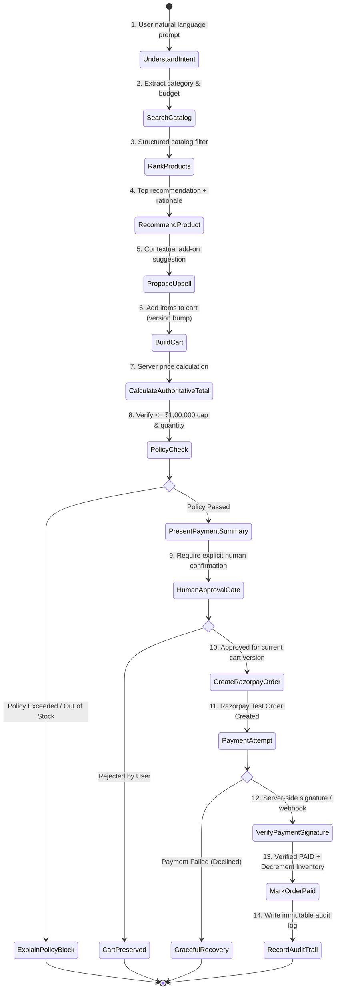

# System Architecture & State Machine

## 1. Overview
The Razorpay AI Growth & Agentic Commerce Platform implements a strict **Separation of Concerns**:
- **LLM / AI Layer:** Handles intent understanding, natural language reasoning, catalog search query extraction, product recommendation with explainability, and contextual upsell generation.
- **Deterministic Backend Authority:** Holds 100% control over pricing, inventory checks, bounded policy enforcement, human approval verification, Razorpay test order creation, and payment verification/webhooks.

```
┌─────────────────┐       ┌──────────────────────┐       ┌────────────────────────┐
│  React Frontend │ <---> │  FastAPI API Gateway │ <---> │ Deterministic Services │
│ (Commerce + BI) │       │     (/api/v1/...)    │       │ (Policy / DB / Order)  │
└─────────────────┘       └──────────┬───────────┘       └───────────┬────────────┘
                                     │                               │
                                     ▼                               ▼
                          ┌──────────────────────┐       ┌────────────────────────┐
                          │   Agent Runner       │       │    Razorpay Test API   │
                          │ (Gemini / Groq Tools)│       │  (Orders, Webhooks)    │
                          └──────────────────────┘       └────────────────────────┘
```

---

## 2. 18-Step Agentic Commerce Pipeline



---

## 3. Database Schema

| Table | Purpose |
| :--- | :--- |
| `users` | Customer reference and identity. |
| `merchants` | Merchant profile and store configuration. |
| `products` | Authoritative catalog items, prices in minor units (paise), inventory, and attributes JSON. |
| `carts` | Session shopping carts with integer versioning for approval invalidation. |
| `cart_items` | Individual line items and authoritative unit totals. |
| `orders` | Completed checkout orders linked to carts and Razorpay order IDs. |
| `payments` | Recorded transaction attempts, methods, and error codes. |
| `approvals` | Explicit user approval checkpoints bound to specific cart versions. |
| `agent_runs` | Conversational session runs with model telemetry. |
| `agent_actions` | Granular tool executions, arguments, summaries, and latency ms. |
| `audit_logs` | Immutable event stream for full traceability. |
| `webhook_events` | Idempotent webhook event ledger. |
